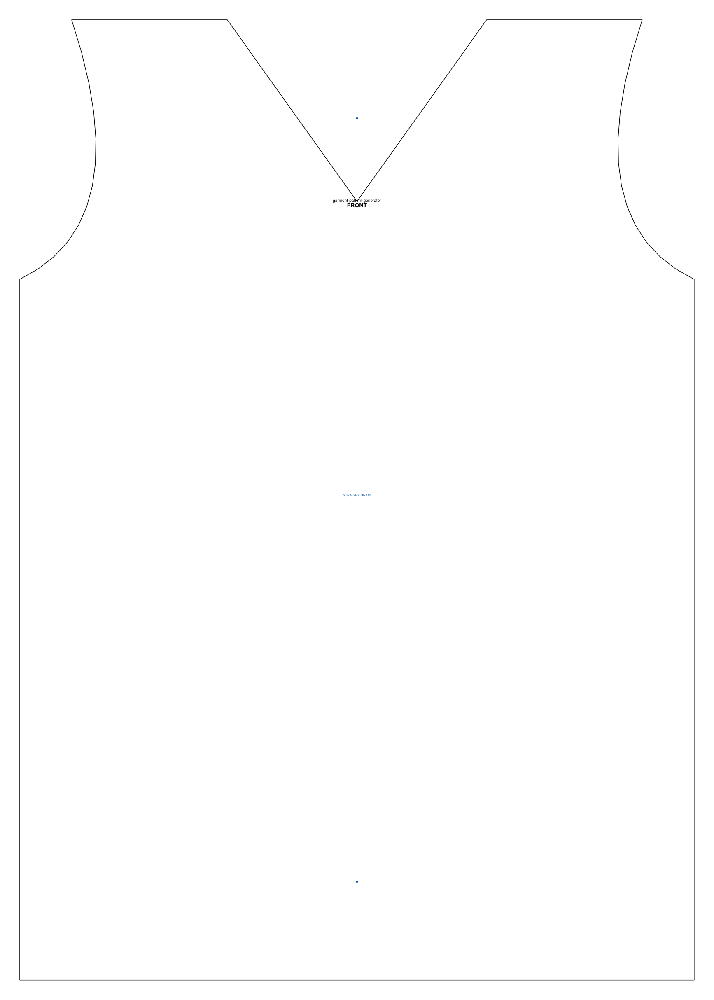

# PatternBridge

[](https://github.com/JinnZ2/PatternBridge/actions/workflows/tests.yml)
[](https://www.python.org/)
[](LICENSE)

**Turn a sewing pattern into geometry you can resize, encode, and re-print.**

PatternBridge reads sewing patterns — from a photo, a PDF, or an open pattern
template — and turns each piece into structured geometry: an ordered boundary,
grain line, notches, darts. Once a piece is geometry, it can be graded to your
own measurements and written back out as SVG, a tiled PDF you can print at
home, or JSON.

<p align="center">
  
</p>

<sub>A tee front, imported from an MIT-licensed template, encoded, and rendered
by the pipeline. Nothing in this image was traced by hand.</sub>

---

## Why

Sewing patterns are locked in paper and flattened PDFs. Resizing one to a body
that isn't a standard size means redrawing it. PatternBridge treats a pattern
as **data** instead — so grading to a 36″ inseam, or a size 0 frame with
muscle, is a parameter rather than an afternoon with a ruler.

## Quick start

```bash
git clone https://github.com/JinnZ2/PatternBridge && cd PatternBridge
pip install -e ".[dev]"
pytest tests/ -q          # 453 tests
python examples/quick_start.py
```

Draft a piece from open geometry, grade it, and print it:

```python
from tools.import_garment_patterns import template_to_pieces
from pattern_geometry.scaler import PatternScaler
from pattern_output.svg_writer import SVGWriter

piece  = template_to_pieces("skirt_4_panels.json")[0]
result = PatternScaler.for_tall_36_36().scale(piece)
print(result.summary())                              # what moved, and by how much
SVGWriter().save(result.scaled_piece, "skirt.svg")   # real-world scale, 96 px/inch
```

## What's in here

**A pipeline.** Image → vision analysis → geometry → graded pattern → SVG /
tiled PDF / JSON. `bridge/pattern_bridge.py` runs the whole thing; every stage
also works on its own.

**An SVG importer.** Point it at any vector pattern — a FreeSewing export, an
Inkscape tracing, a digitiser's file — and each closed path comes back as a
piece, at true size:

```bash
python -m tools.import_svg_patterns aaron.svg --list
```

It reads real-world scale from the SVG header, so a millimetre document and a
96 px/inch one both land correctly in inches.

**124 pattern pieces as open geometry.** `data_geometry/` holds exact boundary
data imported from [Garment-Pattern-Generator][gpg] (MIT) — skirts, pants,
tees, jackets, dresses, jumpsuits. No images, no licensing question, ready to
encode and grade.

**Parametric grading.** `PatternScaler` moves landmark points by grade rules
with zone-based smoothing, and carries darts, notches and lengthen/shorten
lines along with them. Two profiles ship built in; measurements are just a dict.

**Geometric encoding.** Boundaries compile to tokens from the
[Geometric-to-Binary][g2b] framework — sparse on straight runs, dense through
curves — so a shape can be compared, stored, and rescaled as symbols rather
than pixels.

**A licence triage tool.** `--check` reads a pattern PDF and tells you whether
you may share it, before you build anything on top of it:

```
$ python tools/extract_pdf_patterns.py --check ~/Downloads

DO NOT USE    some-hat.pdf
              personal use only: "…This is a pattern for charity or personal use only…"
PERSONALISED  boots.pdf
              stamped with buyer@example.com
              -> this copy was almost certainly bought — keep it local
NO TERMS      old-download.pdf
              says of itself: title: 5001.purse | www.kwiksew.com
              -> not a licence — keep local unless you know it was free
```

That last case is the common one. A pattern downloaded years ago looks
identical whether it was free or paid, so the default is simply to keep it
local: it still trains the classifier, it just isn't published.

## Where patterns come from

[`docs/PATTERN_SOURCES.md`](docs/PATTERN_SOURCES.md) lists open-source, free,
and vintage pattern sources with their licensing — and flags the ones whose
claims don't hold up. [FreeSewing][freesewing] and [Garment-Pattern-Generator][gpg]
are the two worth reaching for first: explicit licences, machine-readable
output, no ambiguity.

## Licensing, seriously

Pattern PDFs are copyrighted even when they're free downloads, and "vintage"
is not "public domain." Every source in this repo is recorded in
[`data/PROVENANCE.md`](data/PROVENANCE.md) with the notice printed in its own
PDF, and anything whose terms forbid sharing — or whose origin can't be
established — is **not committed**. It goes to a gitignored `data_local/`
instead, where it still trains the classifier without being republished.

If you contribute pattern data, run `--check` on it first.

**The MIT licence covers the code, not the patterns.** Each image in `data/`
keeps its publisher's own terms, recorded in its sidecar JSON — see
[`DATA_LICENSE.md`](DATA_LICENSE.md). A repo licence can only give away rights
the author actually holds.

## Status

Working: geometry import, encoding, grading, SVG/PDF/JSON output, the PDF
extractor and licence triage, SVG import, 453 passing tests.

Not yet proven: the vision layer has been built and unit-tested but not
validated against a real corpus of photographed patterns — that needs training
data, which is what `data/` is slowly becoming.

## Contributing

The easiest useful contribution is **a new pattern source**. Add an entry to
the registry in `tools/extract_pdf_patterns.py` describing where each piece
sits on the page, and the extractor does the rest — see the existing entries
for the shape. Run `--check` on the PDF first, and set `redistributable`
honestly.

Bug reports and geometry fixes equally welcome. `pytest tests/ -q` before
opening a PR.

## Ecosystem

Part of the JinnZ2 ecosystem — bridges [Geometric-to-Binary][g2b] and
[hands-lie-detector][hld] into the sewing pattern domain.

[gpg]: https://github.com/maria-korosteleva/Garment-Pattern-Generator
[g2b]: https://github.com/JinnZ2/Geometric-to-Binary-Computational-Bridge
[hld]: https://github.com/JinnZ2/hands-lie-detector
[freesewing]: https://freesewing.org
